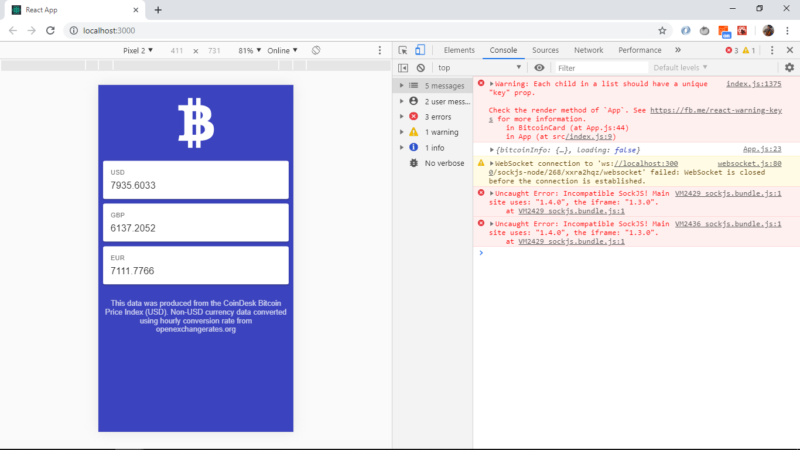

# :zap: Ionic React Bitcoin

* App to display current bitcoin price data (BPI) in USD, EUR, and GBP from the [CoinDesk Bitcoin Price Index API](https://www.coindesk.com/api).
* This is a great tutorial from Paul Halliday of the Developer School, [Youtube video series: 'Ionic 4 & React - Bitcoin Price Tracker'](https://www.youtube.com/watch?v=sPvL3OlnmI8&list=PLtKjv92L0ihBWO6NtZhXEsR9NXf7Uf_ki&index=1)

## :page_facing_up: Table of contents

* [:zap: Ionic React Bitcoin](#zap-ionic-react-bitcoin)
  * [:page_facing_up: Table of contents](#page_facing_up-table-of-contents)
  * [:books: General info](#books-general-info)
  * [:camera: Screenshots](#camera-screenshots)
  * [:signal_strength: Technologies](#signal_strength-technologies)
  * [:floppy_disk: Setup](#floppy_disk-setup)
  * [:computer: Code Examples](#computer-code-examples)
  * [:cool: Features](#cool-features)
  * [:clipboard: Status & To-do list](#clipboard-status--to-do-list)
  * [:clap: Inspiration](#clap-inspiration)
  * [:envelope: Contact](#envelope-contact)

## :books: General info

* This project was bootstrapped with [Create React App](https://github.com/facebook/create-react-app).

## :camera: Screenshots



## :signal_strength: Technologies

* [Ionic v5](https://ionicframework.com/)
* [Ionic/react v5](https://ionicframework.com/)
* [React v16](https://reactjs.org/)
* [CoinDesk Bitcoin Price Index API](https://www.coindesk.com/api)
* [npx](https://www.npmjs.com/package/npx) CLI tool whose purpose is to make it easy to install and manage dependencies hosted in the npm registry.

## :floppy_disk: Setup

* To start the server on _localhost://3000_ type: 'npm run start'

## :computer: Code Examples

* display bitcoin logo and API prices & disclaimer

```javascript
  render() {
    const { bitcoinInfo, loading } = this.state;
    return (
      <IonApp>
        <IonContent>
          <section>
            <IonIcon icon={logoBitcoin} className="bitcoin__logo" />
          </section>
            {loading
              ? this.createLoadingCards()
              : this.createBitcoinCards(bitcoinInfo)}
          <section className="bitcoin__disclaimer">
            <p>{bitcoinInfo.disclaimer}</p>
          </section>
        </IonContent>
      </IonApp>
    );
  }
```

## :cool: Features

* Shows skeleton cards while data is loading.
* Bitcoin price shown in dollars, UK pounds and euros. See API ref for more cryptocurrency options.

## :clipboard: Status & To-do list

* Status: Working.
* To-do: nothing

## :clap: Inspiration

* Paul Halliday of the Developer School, Youtube video series: 'Ionic 4 & React - Bitcoin Price Tracker'
* [Video 1 of 9: Project Overview](https://www.youtube.com/watch?v=sPvL3OlnmI8&list=PLtKjv92L0ihBWO6NtZhXEsR9NXf7Uf_ki&index=1)
* [FCC: npm vs npx — What’s the Difference?](https://www.freecodecamp.org/news/npm-vs-npx-whats-the-difference/)

## :envelope: Contact

* Repo created by [ABateman](https://www.andrewbateman.org) - you are welcome to [send me a message](https://andrewbateman.org/contact)
