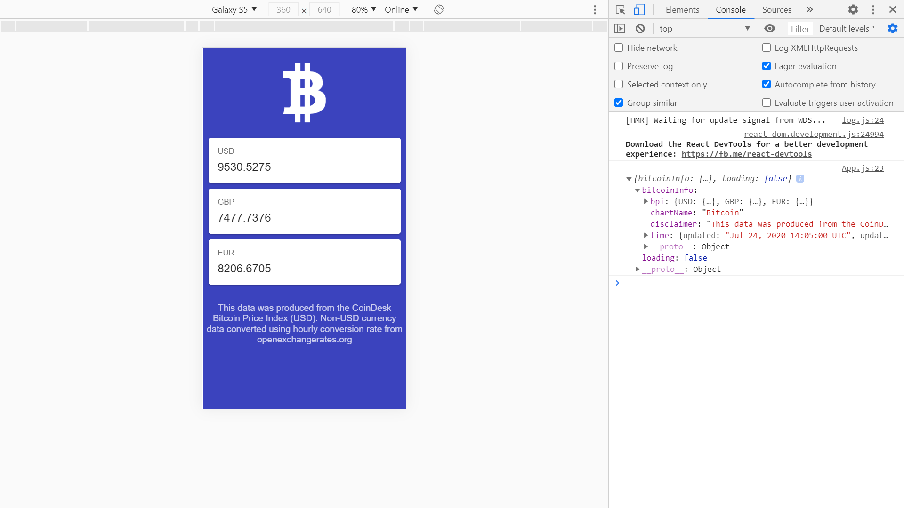

# Ionic React Bitcoin

App to display current bitcoin price data (BPI) in USD, EUR, and GBP from the [CoinDesk Bitcoin Price Index API](https://www.coindesk.com/api).

This is a great tutorial from Paul Halliday of the Developer School, [Youtube video series: 'Ionic 4 & React - Bitcoin Price Tracker'](https://www.youtube.com/watch?v=sPvL3OlnmI8&list=PLtKjv92L0ihBWO6NtZhXEsR9NXf7Uf_ki&index=1)

## Table of contents

* [General info](#general-info)
* [Screenshots](#screenshots)
* [Technologies](#technologies)
* [Setup](#setup)
* [Features](#features)
* [Status](#status)
* [Inspiration](#inspiration)
* [Contact](#contact)

## General info

* This project was bootstrapped with [Create React App](https://github.com/facebook/create-react-app).

## Screenshots



## Technologies

* [Ionic v4.11.1](https://ionicframework.com/)
* [Ionic/react v4.11.1](https://ionicframework.com/)
* [React v16.10.2](https://reactjs.org/)
* [CoinDesk Bitcoin Price Index API](https://www.coindesk.com/api)

## Setup

* To start the server on _localhost://3000_ type: 'npm run start'

## Code Examples

* display bitcoin logo and API prices & disclaimer

```javascript
  render() {
    const { bitcoinInfo, loading } = this.state;
    return (
      <IonApp>
        <IonContent>
          <section>
            <IonIcon icon={logoBitcoin} className="bitcoin__logo" />
          </section>
            {loading
              ? this.createLoadingCards()
              : this.createBitcoinCards(bitcoinInfo)}
          <section className="bitcoin__disclaimer">
            <p>{bitcoinInfo.disclaimer}</p>
          </section>
        </IonContent>
      </IonApp>
    );
  }
```

## Features

* Shows skeleton cards while data is loading.

* Bitcoin price shown in dollars, UK pounds and euros. See API ref for more cryptocurrency options.

## Status & To-do list

* Status: Working. 1 error in dev console.

* To-do: Correct render method error and key prop warning. Develop into more advanced app.

## Inspiration

* Paul Halliday of the Developer School, Youtube video series: 'Ionic 4 & React - Bitcoin Price Tracker'

[Video 1 of 9: Project Overview](https://www.youtube.com/watch?v=sPvL3OlnmI8&list=PLtKjv92L0ihBWO6NtZhXEsR9NXf7Uf_ki&index=1)

## Contact

Repo created by [ABateman](https://www.andrewbateman.org) - feel free to contact me!
